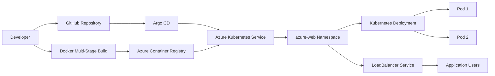

# 🚀 Azure AKS GitOps with Argo CD

A hands-on **DevOps & GitOps project** demonstrating the deployment of a containerized Go application to **Azure Kubernetes Service (AKS)** using **Docker, Azure Container Registry (ACR), Kubernetes, GitHub, and Argo CD**.

The project demonstrates:

- 🐳 Containerized application deployment
- ☁️ Azure Kubernetes Service
- 📦 Azure Container Registry
- ☸️ Kubernetes deployments and services
- 🔄 GitOps-based automated synchronization
- 🔍 Configuration drift detection
- ❤️ Argo CD self-healing
- 🌐 Azure LoadBalancer-based application exposure

---

## 🏗️ Architecture



---

## 📋 Project Overview

This project implements an end-to-end **GitOps workflow** for deploying a Go web application on **Azure Kubernetes Service (AKS)**.

### 🔄 Deployment Workflow

```text
Developer
    |
    | Git Push
    v
GitHub
    |
    | Repository monitored by Argo CD
    v
Argo CD
    |
    | Automated Synchronization
    v
Azure AKS
    |
    v
Kubernetes Deployment
    |
    +---- Pod 1
    |
    +---- Pod 2
```

The Kubernetes manifests stored in Git define the **desired state** of the application.

Argo CD continuously compares the desired state in Git with the live state in AKS and reconciles differences automatically.

---

## 🛠️ Technology Stack

| Category | Technology |
|---|---|
| ☁️ Cloud | Microsoft Azure |
| ☸️ Kubernetes | Azure Kubernetes Service (AKS) |
| 📦 Container Registry | Azure Container Registry (ACR) |
| 🐳 Containerization | Docker |
| 🔄 GitOps | Argo CD |
| 🐙 Source Control | Git / GitHub |
| 💻 Application | Go |
| 📄 Configuration | Kubernetes YAML |
| 🖥️ CLI | Azure CLI / kubectl |
| 🌐 Service Exposure | Azure LoadBalancer |

---

## 💻 Application

The project contains a lightweight **Go HTTP application**.

### 🏠 Home Endpoint

```text
/
```

**Response:**

```text
Hello from Azure AKS GitOps!
```

### 📚 Courses Endpoint

```text
/courses
```

**Response:**

```text
Azure DevOps | Docker | Kubernetes | Helm | Argo CD
```

**Application Port:** `8081`

---

## 📁 Repository Structure

```text
azure-aks-gitops/
│
├── app/
│   ├── go.mod
│   └── main.go
│
├── k8s/
│   ├── namespace.yaml
│   ├── deployment.yaml
│   └── service.yaml
│
├── argocd/
│   └── application.yaml
│
├── Dockerfile
├── .gitignore
└── README.md
```
---


---

# 🐳 Docker

The application uses a **multi-stage Docker build** to separate the build environment from the lightweight runtime environment.

### 🔨 Build Stage

The Go application is compiled using:

```text
golang:1.26-alpine
```

### 🚀 Runtime Stage

The compiled application runs using:

```text
alpine:latest
```

### 🔨 Build the Docker Image

```bash
docker build -t azure-web-app:v2 .
```

### ▶️ Run Locally

```bash
docker run -d \
  --name azure-web-app-test \
  -p 8082:8081 \
  azure-web-app:v2
```

### 🧪 Test the Application

```bash
curl http://localhost:8082/
```

```bash
curl http://localhost:8082/courses
```


---

# 📦 Azure Container Registry

The application image is stored in **Azure Container Registry (ACR)**.

### 🗄️ Registry

```text
pvgitopsacr2026.azurecr.io
```

### 🐳 Container Image

```text
pvgitopsacr2026.azurecr.io/azure-web-app:v2
```

### ⬆️ Push Image to ACR

```bash
docker push pvgitopsacr2026.azurecr.io/azure-web-app:v2
```

---

# ☁️ Azure Kubernetes Service

The application is deployed to **Azure Kubernetes Service (AKS)**.

| Configuration | Value |
|---|---|
| **AKS Cluster** | `aks-azure-gitops` |
| **Resource Group** | `rg-azure-gitops` |
| **Region** | `eastus2` |
| **Kubernetes Version** | `1.36.2` |
| **Node VM Size** | `Standard_D4s_v7` |
| **Node Count** | `1` |
| **Networking** | Azure CNI Overlay |

---

# ☸️ Kubernetes Deployment

The application runs in the:

```text
azure-web
```

namespace.

### 🔢 Replicas

The Deployment maintains:

```text
2 replicas
```

### 🐳 Container Image

```text
pvgitopsacr2026.azurecr.io/azure-web-app:v2
```

### 🔌 Container Port

```text
8081
```

### 📊 Resource Requests

```text
CPU:    100m
Memory: 64Mi
```

### 🚦 Resource Limits

```text
CPU:    250m
Memory: 128Mi
```

---

# 🌐 Kubernetes Service

The application is exposed using a Kubernetes **LoadBalancer** service.

```yaml
type: LoadBalancer
```

### 🔀 Traffic Flow

```text
Internet
    |
    v
Azure LoadBalancer
    |
    | Port 80
    v
Kubernetes Service
    |
    | targetPort 8081
    v
Azure Web Application Pods
```

### 🔍 Check the Service

```bash
kubectl get svc -n azure-web
```

### 🌐 Get the External IP

```bash
kubectl get svc azure-web-app -n azure-web
```

### 🧪 Test the Application

```bash
curl http://<EXTERNAL-IP>/
```

```bash
curl http://<EXTERNAL-IP>/courses
```

---

# 🔄 Argo CD GitOps

**Argo CD** is used as the GitOps controller for the AKS cluster.

The Argo CD Application definition is stored in:

```text
argocd/application.yaml
```

### 📌 Application Source

```text
GitHub Repository
        |
        v
pvenki8890/azure-aks-gitops
        |
        v
k8s/
```

### 🎯 Target Namespace

```text
azure-web
```

### ⚙️ Automated Synchronization & Self-Healing

Argo CD is configured with automated synchronization, pruning, and self-healing:

```yaml
syncPolicy:
  automated:
    prune: true
    selfHeal: true
```

---

## 🔄 GitOps Workflow

```text
                 GitHub
                    |
                    | Desired State
                    v
                Argo CD
                    |
                    | Reconciliation
                    v
                  AKS
                    |
                    v
             Kubernetes Pods
```

Git acts as the **source of truth** for the Kubernetes configuration.

---

# 🧪 GitOps Demonstration

## 🔄 Automated Synchronization

The application was initially deployed and later changed to run:

```text
2 replicas
```

The Kubernetes configuration was committed and pushed to GitHub.

Argo CD detected the Git revision and automatically synchronized the AKS Deployment.

### ✅ Final Verified State

```text
Argo CD:       Synced
Health:        Healthy
Deployment:    2/2
Pods:          2 Running
```

### 🔄 Synchronization Flow

```text
Git Change
    |
    v
GitHub
    |
    v
Argo CD
    |
    | Automatic Sync
    v
AKS
```

---

# ❤️ Argo CD Self-Healing

Argo CD was configured with:

```yaml
selfHeal: true
```

To demonstrate **configuration drift**, the live Kubernetes Deployment was manually scaled:

```bash
kubectl scale deployment azure-web-app \
  -n azure-web \
  --replicas=1
```

The desired state in Git remained:

```text
2 replicas
```

Argo CD detected the difference between the Git-defined desired state and the live Kubernetes state.

It automatically reconciled the Deployment back to:

```text
2 replicas
```

### ✅ Final Verified State

```text
Argo CD:       Synced
Health:        Healthy
Deployment:    2/2
Pods:          2 Running
```

### 🛡️ Self-Healing Flow

```text
Manual Cluster Drift
        |
        v
Argo CD Detects Drift
        |
        v
Automatic Reconciliation
        |
        v
Desired State Restored
```

---

# 🔍 Verification

## 🔄 Argo CD

```bash
kubectl get application azure-web-app -n argocd
```

**Expected:**

```text
NAME            SYNC STATUS   HEALTH STATUS
azure-web-app   Synced        Healthy
```

---

## ☸️ Deployment

```bash
kubectl get deployment azure-web-app -n azure-web
```

**Expected:**

```text
READY   UP-TO-DATE   AVAILABLE
2/2     2            2
```

---

## 🟢 Pods

```bash
kubectl get pods -n azure-web -o wide
```

**Expected:**

```text
2 pods
1/1 Running
```

---

## 📦 Application Resources

```bash
kubectl get all -n azure-web
```

---

# 🎯 Key DevOps Practices Demonstrated

- 🐳 Docker multi-stage builds
- 📦 Containerized Go application
- ☁️ Azure Container Registry
- ☸️ Azure Kubernetes Service
- 🚀 Kubernetes Deployments
- 🌐 Kubernetes Services
- 📁 Kubernetes namespaces
- 🔢 Kubernetes replica management
- 📊 Resource requests and limits
- 🐙 Git-based configuration management
- 🔄 Argo CD GitOps
- ⚡ Automated synchronization
- 🔍 Configuration drift detection
- ❤️ GitOps self-healing
- 📜 Declarative Kubernetes management
- 🖥️ Azure CLI
- ☸️ kubectl
- 🐙 GitHub version control

---

# 🧠 Skills Demonstrated

## ☁️ Azure

- Azure Kubernetes Service (AKS)
- Azure Container Registry (ACR)
- Azure LoadBalancer
- Azure Managed Identity
- Azure CLI

## ☸️ Kubernetes

- Deployments
- Services
- Namespaces
- Pods
- Replica management
- Resource requests and limits
- Kubernetes troubleshooting

## 🔄 DevOps / GitOps

- Docker
- Git
- GitHub
- Argo CD
- Continuous reconciliation
- Declarative configuration
- Configuration drift management
- Self-healing deployments

---

# 🏆 Project Outcome

This project demonstrates a complete **GitOps deployment workflow**:

```text
Developer
    |
    v
GitHub
    |
    v
Argo CD
    |
    v
Azure Kubernetes Service
    |
    v
Kubernetes Deployment
    |
    v
Containerized Go Application
    |
    v
Azure LoadBalancer
```

The implementation demonstrates:

- 🔄 Automated deployment synchronization
- 📜 Declarative Kubernetes management
- 🔍 Configuration drift detection
- ❤️ Argo CD self-healing
- ☁️ Cloud-native application deployment

These are practical **DevOps, Platform Engineering, and SRE** practices for managing cloud-native applications.

---

# 🧹 Cleanup

> ⚠️ **Do not run these commands while the project environment is still required.**

### 🗑️ Delete the Application Namespace

```bash
kubectl delete namespace azure-web
```

### 🗑️ Delete the Argo CD Application

```bash
kubectl delete application azure-web-app -n argocd
```

### 🗑️ Delete the AKS Cluster

```bash
az aks delete \
  --resource-group rg-azure-gitops \
  --name aks-azure-gitops \
  --yes
```

---

## ⭐ Project Summary

**Azure AKS GitOps with Argo CD** demonstrates how modern DevOps teams can use **Git as the source of truth** to manage Kubernetes workloads on Azure.

The project combines:

**🐙 GitHub → 🔄 Argo CD → ☁️ AKS → ☸️ Kubernetes → 🐳 Go Application**

with automated synchronization and self-healing to maintain the desired application state.
